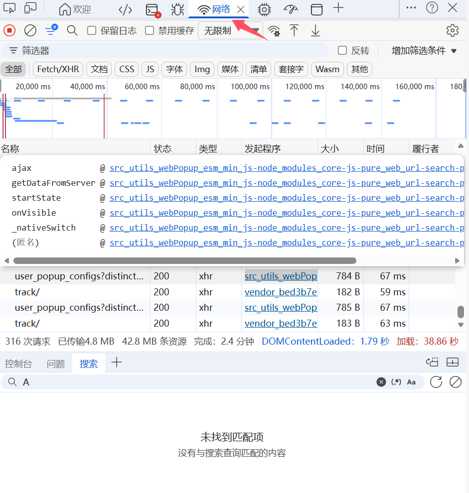
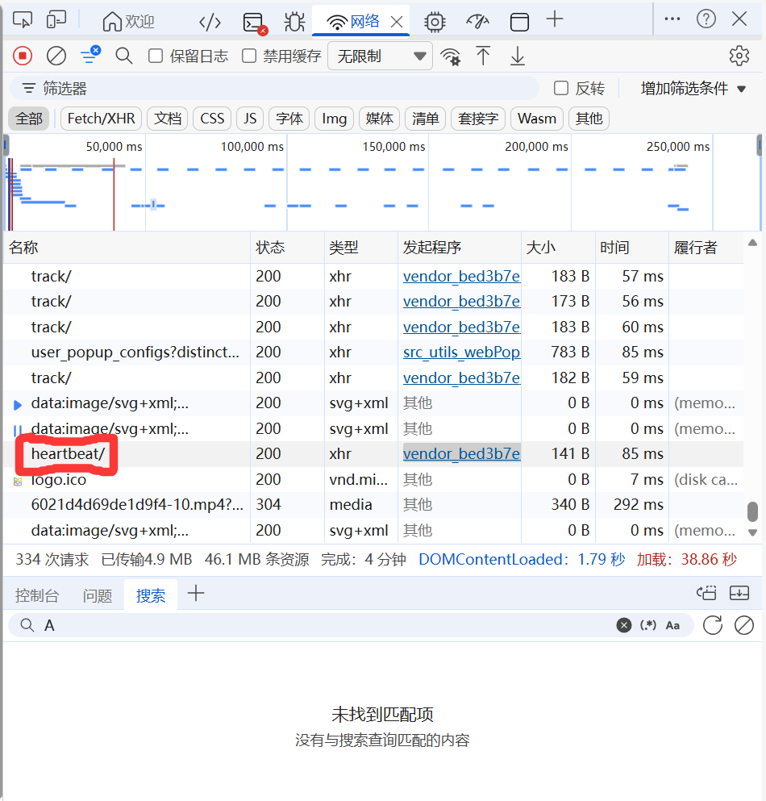
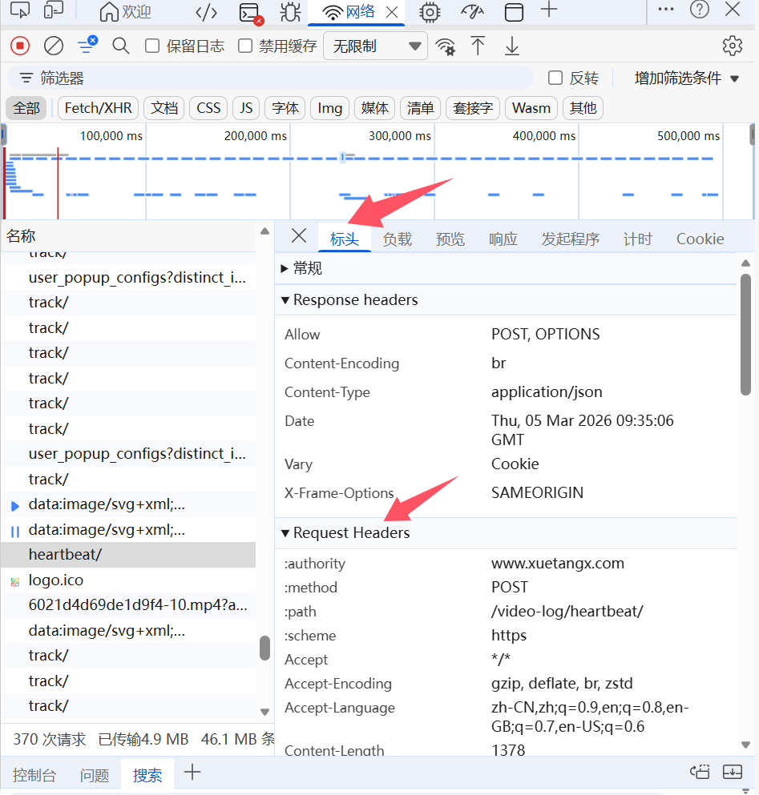
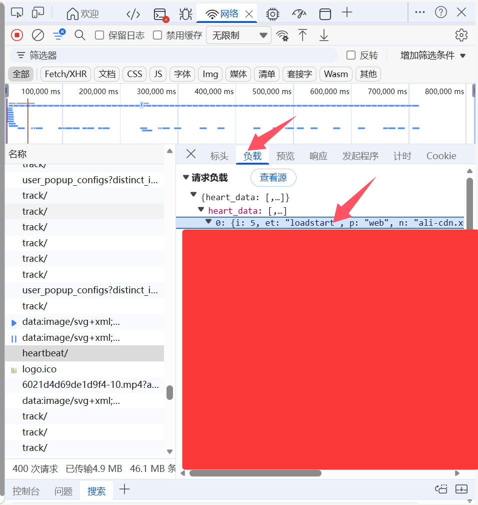

# 2026_UESTC_XTZX_HELPER
**电子科大学堂在线刷课脚本**

> 其实也适用于其他学堂在线的课程
- **使用教程**

  找到代码中对应的 **参数** 并填上即可，这里说一下怎么找：

  - **u，c，skuid，cc，X_Csrftoken，Cookie**：

    - 打开 **浏览器**，进入 **智慧慕课学习空间** 的页面，就是网页 左上角 有以下这个东西的页面：
      - 

    - 按 **F12**（或者 **右键 $\rightarrow$ 检查**），打开 **开发者工具**，然后进入 **网络**：
      - 
    - 随便点一个视频 **播放**，在 **网络** 界面等一会，应该会出现一个 **hearbeat** 包：
      - 
    - 单击 **heartbeat**，在右边选择 **标头**，接着就在 **Request Headers** 里能找到 **Cookie** 和 **X-Csrftoken**，把右边的值写进代码中就行了：
      - 
    - 然后去到 **负载**，打开 **heartbeat_data**，里面就能找到 **u，c，skuid，cc**，填到代码里面就行：
      - 

  - **school_course_id，classroomid，video_start，video_end**

    - 进入到 **智能慕课学习空间** 后，**网址** 中即可找到，举个例子：

      - ```bash
        https://www.xuetangx.com/learn/space/XXX114514/XXX114514/114514/video/1145141919810
        ```

      - **school_course_id**：XXX114514
      - **classroomid**：114514
      - **video_start，video_end**：1145141919810 即为 **视频 ID**，按需找到 **起始 ID** 和 **结束 ID** 即可