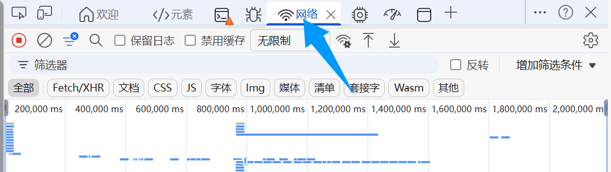
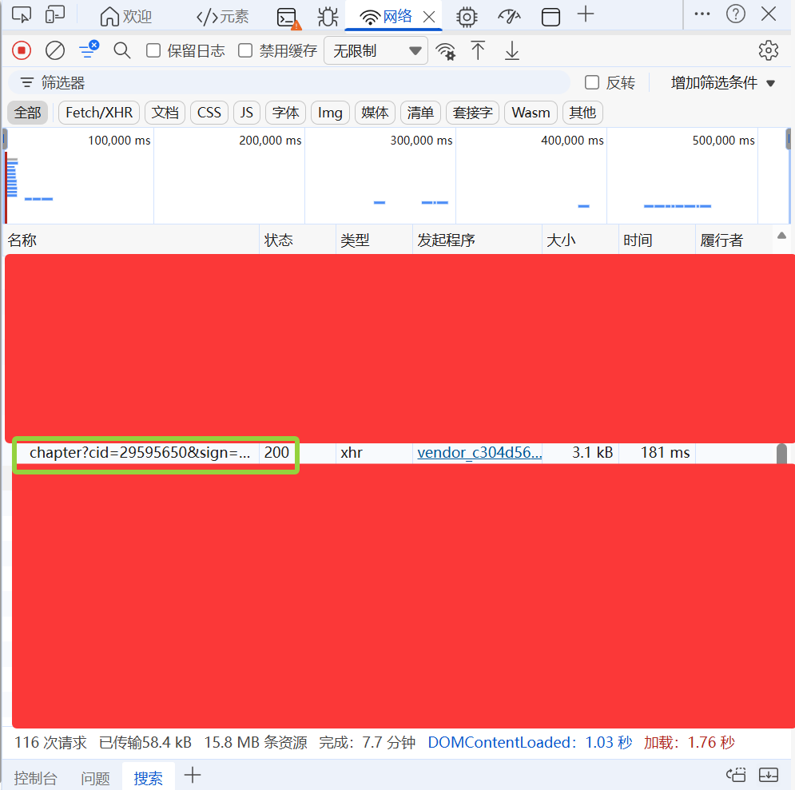
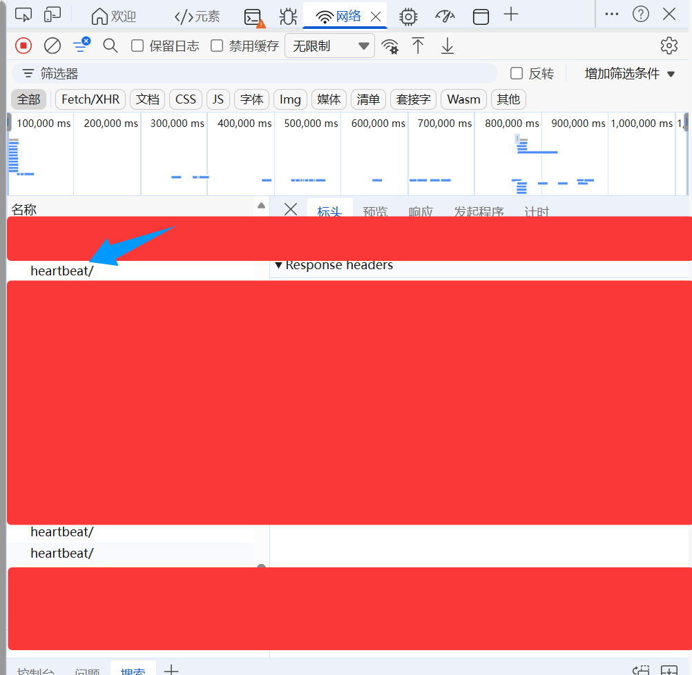
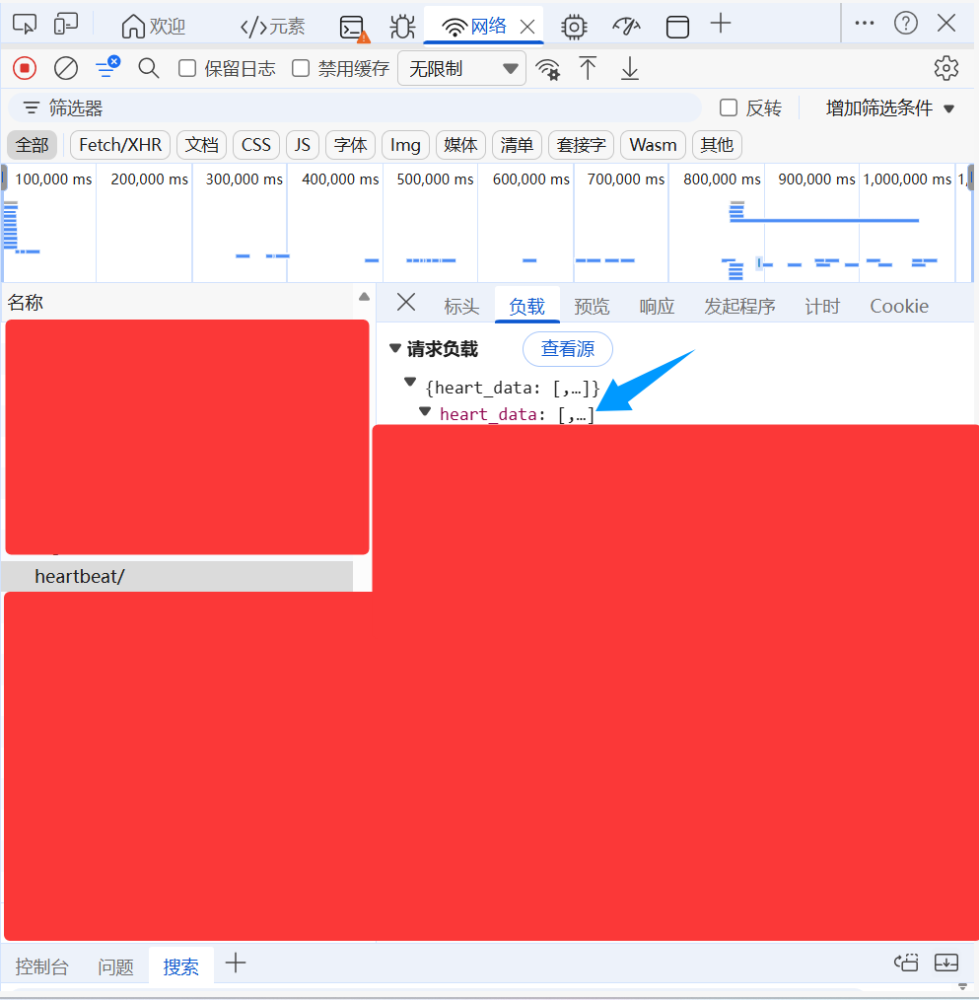

# 2026_UESTC_XTZX_HELPER
**电子科大学堂在线刷课脚本**

> 其实也适用于其他学堂在线的课程
- `uestc_xtzx_helper_video.py`：**刷视频**

  - 用到的 **参数**：**d, u, c, skuid, cc, sign, cid, video_start, video_end, headers, cookies**

- `uestc_xtzx_helper_exercise.py`：**获取习题答案 (目前没写自动提交)**

  - 用到的 **参数**：**sign, cid, headers, cookies**
  - 需要 **创建一个新的账号**，这个账号是用于 **随便提交一个错误选项，然后获取答案的**，也就是说 **headers 和 cookies** 都是要填这个账号的。
  - 获取的 答案 输出在 **终端**, 然后保存在 **`answer.json`** 文件里

- **使用教程**

  找到代码中对应的 **参数** 并填上即可，这里说一下怎么找：

  - 打开 **浏览器**，进入 **学习页面**，就是网页 左上角 有以下这个东西的页面：

    - 

  - 然后把网址的 **space** 去掉，比如：

    - ```
      www.xuetangx.com/learn/space/XXX114514/XXX114514/1919810/XXX/114514
      ```

      改成：

      ```
      www.xuetangx.com/learn/XXX114514/XXX114514/1919810/XXX/114514
      ```

      实际上是 改回旧版

  - 按 **F12**（或者 **右键 $\rightarrow$ 检查**），打开 **开发者工具**，然后进入 **网络**：

    > **注：**
    >
    > 1. 如果 网络 这里什么东西都没有的话可以刷新一下网页
    >
    > 2. 我这里用的 edge 浏览器，理论上浏览器不会影响作用，如果 开发者工具 页面不一样也没事，直接按特定的名字找就行了

    - 

  - **参数：headers，cookies**：

    - 找到一个 `chapter/cid=xxx/sign=xxx` 的包：
      - 
    - **右键** 它，选择 **复制 $\rightarrow$ 复制为cURL（bash）**，然后去到这个转换网站 ([在线curl转python工具，爬虫工具 - JSON中文网](https://www.json.cn/curl2python/)) 把 **cURL** 转成 **python**，接着在 右边输出框 把 **headers** 和 **cookies** 填到 `config.py` 即可

  - **参数：u，c，skuid，cc**：

    - 随便点一个视频 **播放**，在 **网络** 界面等一会，应该会出现一个 **hearbeat** 包：
      - 
    - 单击它，去到 **负载**，打开 **heartbeat_data**，里面就能找到 **u，c，skuid，cc**，填到 `config.py` 里面就行：
      - 

  - **sign，cid，video_start，video_end**

    - 进入到 **智能慕课学习空间** 后，**网址** 中即可找到，举个例子：

      - ```bash
        https://www.xuetangx.com/learn/space/XXX114514/XXX114514/114514/video/1145141919810
        ```

      - **sign**：XXX114514
      - **cid**：114514
      - **video_start，video_end**：1145141919810 即为 **视频 ID**，按需找到 **起始 ID** 和 **结束 ID** 即可